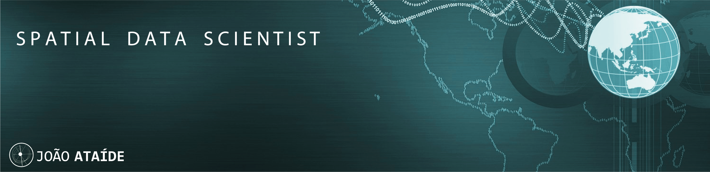

  

# João Ataíde
*Estágiario de Geotecnologias da inPlantar  Meio Ambiente e Engenharia​

Sou graduado em Ciência e Tecnologia na Universidade Federal Rural do Semi-Árido (UFERSA), onde trabalho como bolsista no Acesso a Terra Urbanizada nos projetos Smart Cities, REURBE'S, e hoje no MAPA, obtive experiências práticas e teóricas na área das geotecnologias, com enfase em levantamento cartográfico. Atualmente também sou estagiário da InPlantar Meio Ambiente, e Engenharia, neste realizamos trabalhos com técnicas e ferramentas de geoprocessamento, na aquisição, tratamento e suporte de dados banco de dados. Além disto hoje cursa Engenharia Civil e Especialização em Geoprocessamento e Georreferenciamento na mesma instituição da primeira graduação. 

**Background in:** Python, GIS, PyQGis, QGis, Machine Learning, Geoprocessamento.

**Links:**
* [Blog](https://www.joaoataide.com)
* [LinkedIn](https://www.linkedin.com/in/joaoataidee/)
* [Medium](https://medium.com/@jooataide)

## Projetos:
Veja os projetos publicados no meu blog:

* **Classificação de Roupas usando TensorFlow:**[ Projeto](https://www.joaoataide.com/post/classificação-de-roupas-com-tensorflow)
* **Analisar os termos mais frequentes em artigos do COVID-19:**[ Projeto](https://www.joaoataide.com/post/desafio-kaggle-covid-19)
* **Estimativa de evapotranspiração:**[ Projeto](https://www.joaoataide.com/post/estimativa-da-evapotranspiração)
* **Análise de ocupação irregular de Linhas de Transmissão:**[ Projeto](https://www.joaoataide.com/post/linhas-de-transmissão)
* **Vetorização semiautomática de áreas urbanas:** [ Projeto](https://www.joaoataide.com/post/vetorização-semiautomática)
* **Comparação dos Levantamento Cartográficos Pré e Pós Processado:**[ Projeto](https://www.joaoataide.com/post/pós-e-pré-processados)
---

